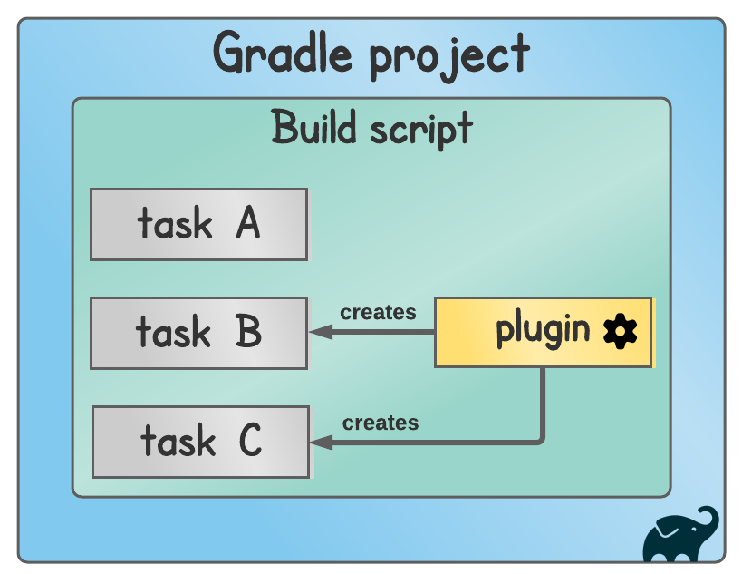

# Technical Report for Class Assignment 2

## Introduction

This is a technical report for de Class Assignment 2 about **Gradle** (a build automation tool that is designed to automate the building, testing, publishing, and deployment of software projects), made by Maria Parreira n.º 1231843, ISEP and Switch student.

This report provides a detailed account of the steps taken to complete the assignment, including the commands used, the issues encountered, and the solutions implemented.

To support this assignment will be used an example application : gradle_basic_demo.

(source code available at https://bitbucket.org/pssmatos/gradle_basic_demo/).

### What is a Gradle Task in and how can we do that?

A Gradle task is a unit of work that can be executed as part of a Gradle build process. 
Tasks are the building blocks of Gradle builds, and they encapsulate actions such as compiling source code, running tests, generating documentation, or deploying artifacts.

Tasks can be defined in _build.gradle_ file of the project. 
You can specify the task name, any dependencies it might have, and the actions it should perform.

This tutorial use **the Gradle build task** frequently. 
This task compiles, tests, and assembles the code into a _JAR file_ (A compressed file that contains Java files, such as classes, resources, metadata, and libraries) 
You can run the build task like this:
```bash
./gradlew build
```
It allows you to run without requiring that Gradle be installed on your system.
Add it to version control system, and everyone that clones this project can build it just the same.


## Gradle Tutorial

Description of the steps used to achieve the **Class Assignment 2 Part 1** requirements using Gradle build tool and Groovy.

1. **Add a task to execute the server**

Go to build.gradle folder and add this script:
```bash
task runServer(type: JavaExec, dependsOn: classes) {
    group = "DevOps"
    description = "A server on localhost:59001 waits for clients."
    classpath = sourceSets.main.runtimeClasspath
    mainClass = 'basic_demo.ChatServerApp'
    args '59001'
}
```
This task sets up and executes a Java application (ChatServerApp) as a server listening on port 59001.

Task of type **JavaExec**, indicating that it will execute a Java class. It depends on the **classes** task, meaning that Gradle will ensure that the classes task has been executed first.
It belongs to a **group** named "DevOps" and provides a **description** of what it does.
This specifies the **classpath** that the JavaExec will use (runtime classpath of the main source) and the **main class** that should be executed when running the task (basic_demo.ChatServerApp).


2. **Add a simple unit test**

To write a quick test for this application, just to make sure it starts with a greeting, let’s create the directory structure with the same package structure:
```
src/test/java/basic_demo/AppTest.java
```
Inside _AppTest.java_ class add JUnit imports.

```bash
import org.junit.Test;
import static org.junit.Assert.*;

public class AppTest {
    @Test public void testAppHasAGreeting() {
        App classUnderTest = new App();
        assertNotNull("app should have a greeting", classUnderTest.getGreeting()); }
}
```

Go to _build.gradle_ folder and add this dependency:
```bash
dependencies {
testImplementation group: 'junit', name:'junit', version:'4.12'
}
```
The JUnit 4.12 library doesn’t come with Java, so we’ll have to add it separately as a dependency for Gradle to download and include on the Java classpath when our test is compiled and run.


3. **Add a new task of type Copy**
At the _build.gradle_ folder and add this script:

```bash
task backup(type: Copy) {
    from 'src'
    into 'backup'
}
```
Task of type **Copy**, indicating that it will perform copying operations with the Copy method (provided by Gradle API).
This will copy all files and directories from the src directory into backup directory.


4. **Add a new task of type Zip**
At the _build.gradle_ folder and add this script:

```bash
task archive(type: Zip) {
    from 'src'
    archiveFileName = "app-source.zip"
    destinationDir = file('archives')
}
```
Task is of type **Zip**, indicating that the ZIP method (provided by Gradle API) will create a ZIP archive.
This will create a ZIP archive named "app-source.zip" containing all files and directories from the src directory and place it in the archives directory.


5. **At the end of this part of this assignment mark your repository with a new tag**

```bash
 git tag -a ca2-part1 -m "ca2-part1 release"
```



from:https://tomgregory.com/gradle/gradle-tutorial-for-complete-beginners/