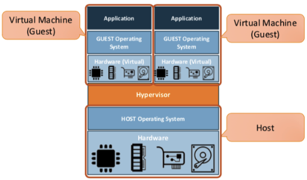

# Technical Report for Class Assignment 3 Part 1

## Introduction

This technical report documents Class Assignment 3 part 1 on **Virtualization**, completed by Maria Parreira (Student ID: 1231843), a student at ISEP and Switch.

The report outlines the processes undertaken to fulfill the assignment requirements, detailing the commands executed, challenges faced, and solutions devised.

### **virtualization**

In simple terms, **virtualization** is a technology used to create virtual representations of servers, storage, networks, and other physical machines. 
Virtualization software replicates the functionalities of physical hardware, allowing multiple virtual machines to operate concurrently on a single physical machine.
It is facilitated by a **hypervisor**, which serves as software enabling the operation of multiple virtual machines on a single physical machine. 
Each virtual machine possesses its own operating system and applications, with the hypervisor managing the allocation of underlying physical computing resources such as CPU and memory to individual virtual machines as needed.

Broadly, there are two forms of virtualization:

1. **Hardware-level virtualization**: The hypervisor operates directly on the host hardware.
2. **Hosted virtualization**: The hypervisor runs atop the host OS.

This Class Assignment focuses on **Hosted virtualization** (as shown in the figure below):



While numerous hypervisors exist, this assignment utilized **UTM**. UTM leverages Apple's Hypervisor virtualization framework to execute ARM64 operating systems on Apple Silicon.

## This Class Assignment is divided into two parts:

#### 1. Creating a Virtual Machine(VM) with UTM and Ubuntu

#### 2. Clone, build and execute projects from previous assignments inside VM


## 1. Creating a Virtual Machine(VM) with UTM and Ubuntu


1. **Download Ubuntu Server**

    Navigate to [Ubuntu Server download page](https://ubuntu.com/download/server/arm) to acquire the 22.04.3 Ubuntu Server.


2. **Install and Configure UTM**

    Install UTM from [mac.getutm.app](https://mac.getutm.app) (complete the setup process according to provided instructions).


3. **Adding a New VM in UTM**

    Launch UTM and locate the option to add a new VM.
    Click the ‘+’ button on the main window.
    
    Choose the virtualization option and select Linux as the operating system.
    
    Browse and select the Ubuntu .iso file downloaded earlier for booting.
    
    Proceed to configure settings such as virtual hard disk size, shared folders, and VM name.
    
    Save the settings to add the new VM to UTM.


4. **Initiating Ubuntu Installation**

    Highlight the Ubuntu virtual machine and click the Start button.

    The VM will boot from the installation disk, initiating the Ubuntu installation process.

    Follow on-screen instructions to select system language, keyboard layout, and network interface configuration.


5. **Customizing Ubuntu Installation Settings**

    Choose "Use an entire disk" option for storage configuration to erase the virtual disk.
    
    Provide appropriate names and password during profile setup.
    
    Opt to skip options for upgrading to Ubuntu Pro, installing OpenSSH server, and Featured Server Snaps.
    
    Wait for the installation process to complete.


6. **Finalizing Installation**

    Press the "Reboot Now" button upon completion of the installation process.
    
    Log in with the provided username and password.
    
    Once logged in, you can access the Linux terminal to execute commands and further configure the system.


## 2. Clone, build and execute projects from previous assignments inside VM

**After installing the Ubuntu on the UTM, the following steps should be taken to complete the assignment:**


### 1. Install git
```bash
sudo apt update
sudo apt install git
```

### 2. Install maven
```bash
sudo apt install maven
```

### 3. Install java 17
```bash
sudo apt install openjdk-17-jdk openjdk-17-jre
```

### 4. Install gradle version 8.6
```bash
wget https://services.gradle.org/distributions/gradle-8.6-bin.zip
sudo mkdir /opt/gradle
sudo unzip -d /opt/gradle gradle-8.6-bin.zip
echo "export GRADLE_HOME=/opt/gradle/gradle-8.6" >> ~/.bashrc
echo "export PATH=$PATH:$GRADLE_HOME/bin" >> ~/.bashrc
source ~/.bashrc
gradle -v
```

### 5. Clone the remote repository
create new folder 
```bash
mkdir devops
cd devops

git clone git@github.com:mariaparreira-code/devops-23-24-JPE-1231843.git
(repository must be public)
```

### 6. Configure maven wrapper and gradle wrapper

Maven wrapper and Gradle wrapper must be given permission to execute.
```bash
chmod +x mvnw
chmod +x gradlew
```

### 7. Run the project at CA1 folder with maven tool

```bash
./mvnw spring-boot:run
```
Get VM IP address with the command
```bash
ip address
```
Open project on browser with " http://(IP):8080 "

### 8. Run the project at CA2 part 1 folder with gradle tool

```bash
./gradlew build
./gradlew runServer
```

To run the client open in host computer terminal at the same project folder, and do:
```bash
./gradlew runClient --args= "(VM IP) 59001" 
```

#### 9. Run the project at CA2 part 2 folder with gradle tool

```bash
./gradlew build
./gradlew bootRun
```
Open project on browser with " http://(IP):8080 "