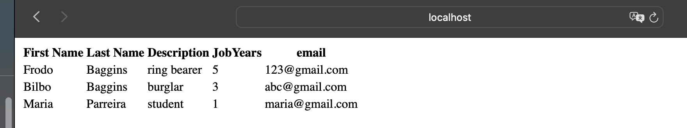
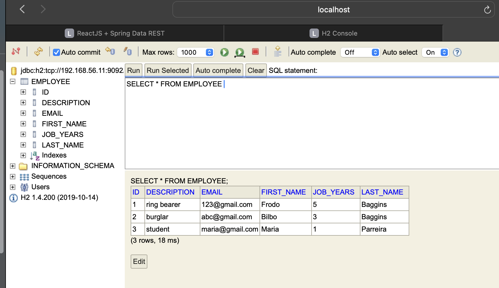

# Technical Report for Class Assignment 3 - Part 2

## Introduction

This technical report documents Class Assignment 3 part 2 about **Virtualization with Vagrant**, completed by Maria Parreira (Student ID: 1231843), a student at ISEP and Switch.

This assignment, will use Vagrant to set up a virtual environment to execute the **tutorial spring boot application (gradle "basic" version)** developed in CA2, Part 2.

### **Vagrant**

Virtualization provides some important advantages such as isolation, sharable and reproducible environment, support different hardware and operating systems.
However, dealing with multiple VMs is hard... Configuring and sharing one VM is manageable, but, when we have to deal with multiple VMs, it is hard to do everything manually.

In this Class Assignment, **Vagrant** will be used in order to configure virtualized development environments efficiently and repeatably.
It simplifies the process of creating and managing development environments, providing standardization, reproducibility, and isolation. 
With Vagrant, we can easily share development environments among team members, automate software provisioning, and ensure that everyone works in identical environments, regardless of their operating systems or local configurations.


[you can find image here](https://medium.com/@kamilmasyhur/vagrant-what-is-that-5ba440427098)


## This Class Assignment is divided into three parts:

#### 1. Install Vagrant in macOS with M1 CPU

#### 2. Setup two VMs for running the Spring Basic Tutorial application


## 1. _Install Vagrant in macOS with M1 CPU_

**To successfully install Vagrant on macOS, the following steps should be followed:**

- Install Xcode command line tools, witch is an Apple's integrated development environment for macOS app development:

```bash
sudo xcode-select --install
```

- Run a Homebrew installation script fetched from GitHub (Homebrew being a package manager):
  Once installed, you can use the brew command to install Vagrant
```bash
/bin/bash -c "$(curl -fsSL https://raw.githubusercontent.com/Homebrew/install/HEAD/install.sh)"
```

- Install QEMU and all its necessary dependencies for emulating operating systems and running software:

```bash
brew install qemu
```

- Install Libvirt and all its necessary dependencies, to manage and interact with VM's and containers programmatically or through command-line tools, providing greater flexibility and control over virtualized environments:

```bash
brew install libvirt
```

- Install Vagrant along with its necessary dependencies:

```bash
  brew install hashicorp/tap/hashicorp-vagrant
```

- Install plugin that allows Vagrant to work with QEMU:

```bash
  vagrant plugin install vagrant-qemu
```

- To check if everything is ok, type in a terminal/console:

```bash
vagrant -v 
```

## 2. _Setup two VMs for running the Spring Basic Tutorial application_

- This vagrant setup uses the spring application available [here](https://bitbucket.org/pssmatos/tut-basic-gradle) as an initial solution. 
- However, it will be adapted for the **Class Assignment 2 Part 2: demoWithGradle** (a Spring Basic Tutorial application).


- **VMs to be configured:**

      1. WEB VM:
         - Executes the web application inside Tomcat9
    
      2. DATA BASE VM:
         - Executes the H2 database as a server process. The web application connects to this VM.


### 1. Copy the contents of the macOS folder from spring application to your repository (inside the folder CA3/Part2)

Use the following command to copy the necessary files 
```bash
cp -r /vagrant-multi-spring-tut-demo/macOS CA3/Part2
```

### 2. Update the Vagrantfile 

**Do the following steps to configure Vagrantfile so that it uses gradle version of the spring application (inside the folder CA2.Part2/demoWithGradle):**


- Change java version:

```bash
sudo apt-get install -y iputils-ping avahi-daemon libnss-mdns unzip \ openjdk-17-jdk-headless
```

- Change the repository used doing:
  (repository must be public)
```bash
git clone https://github.com/mariaparreira-code/devops-23-24-JPE-1231843.git
cd devops-23-24-JPE-1231843/CA2.Part2/demoWithGradle
```

### 3. Go to demoWithGradle folder and open application.properties file

This step is crucial for configuring the Spring Boot application to correctly connect to the H2 database server that will be running on a separate VM.


```
server.servlet.context-path=/basic-0.0.1-SNAPSHOT
spring.data.rest.base-path=/api
spring.datasource.url=jdbc:h2:tcp://192.168.56.11:9092/./jpadb;DB_CLOSE_DELAY=-1;DB_CLOSE_ON_EXIT=FALSE
spring.datasource.driverClassName=org.h2.Driver
spring.datasource.username=sa
spring.datasource.password=
spring.jpa.database-platform=org.hibernate.dialect.H2Dialect
spring.jpa.hibernate.ddl-auto=update
spring.h2.console.enabled=true
spring.h2.console.path=/h2-console
spring.h2.console.settings.web-allow-others=true
```
_server.servlet.context-path_: Defines the context path for the web application.

_spring.data.rest.base-path_: Sets the base path for the REST API. All requests to the REST endpoints should start with /api.

_spring.datasource.username_ and _spring.datasource.password_: Specify the credentials for connecting to the database.


### 4. At demoWithGradle folder Open app.js 

- Update the path of the following method, so it makes a GET request to the specified endpoint /basic-0.0.1-SNAPSHOT/api/employees to fetch employee data. 
- Once the request is successful, it updates the component's state with the retrieved employee data.
```
componentDidMount() { 
		client({method: 'GET', path: '/basic-0.0.1-SNAPSHOT/api/employees'}).done(response => {
			this.setState({employees: response.entity._embedded.employees});});
	}
```

### 5. Execute vagrant

- Execute the following command to download the base Vagrant box, call the hypervisor (QEMU), 
- install hypervisor tools as needed, setup the network and shared folders, run provision scripts to prepare the web and database VM's:

```bash
sudo vagrant up
```

### 6. Open VM's

- After that it is possible open and execute VM's with following commands:

```bash
sudo vagrant ssh web
```


```bash
sudo vagrant ssh db
```


### 7. Run Spring Boot Application on Web VM

-Go to the CA2.Part2/demoWithGradle folder and use the following command :

```gradle
./gradlew bootRun
```

### 8. In the host machine open the application in browser using the following url

```
http://localhost:8080/basic-0.0.1-SNAPSHOT/
```



### 9. Open the H2 console using the following url on browser

```
http://localhost:8082/
```
- After that, for the connection use: jdbc:h2:tcp://192.168.56.11:9092/./jpadb



### 10. At the end of the part 2 of this assignment mark your repository with the tag ca3-part2.

```bash
git tag ca3-part2
```

## Conclusion

Through the outlined setup process, a seamless and reproducible development environment was established using Vagrant.
This enabled efficient management of multiple VMs and ensured consistent deployment across diverse operating systems. 