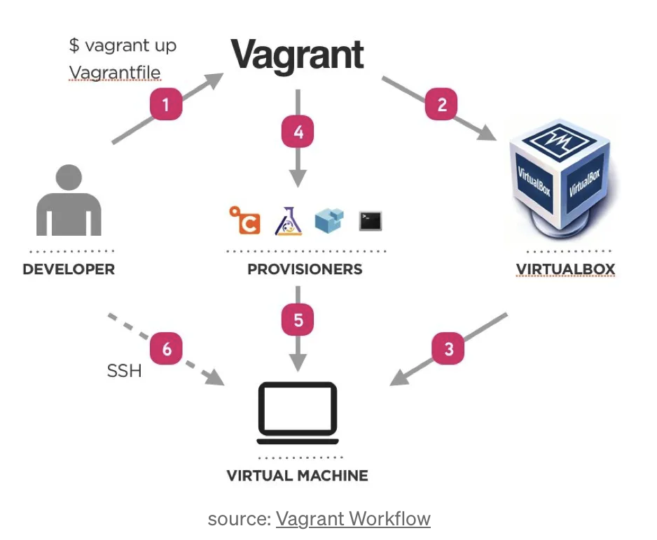
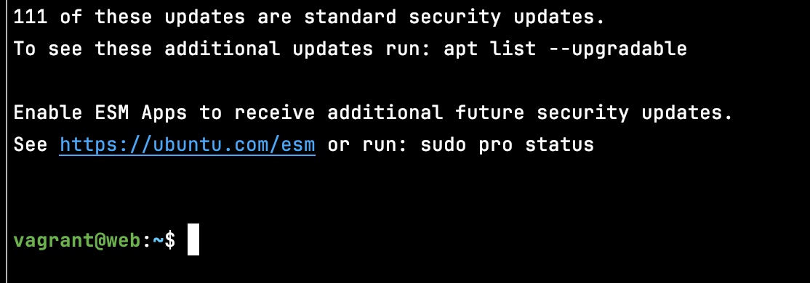
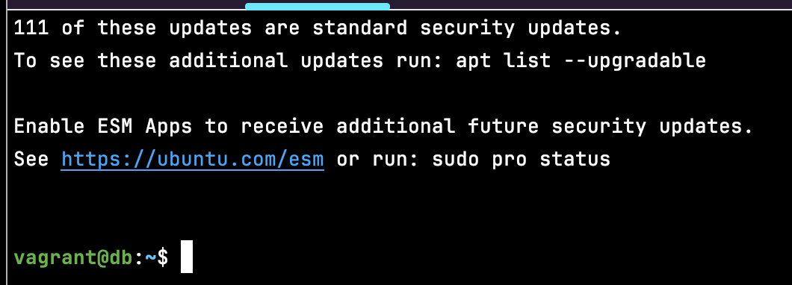

# Technical Report for Class Assignment 3 - Part 2

## Introduction

This technical report documents Class Assignment 3 part 2 about **Virtualization with Vagrant**, completed by Maria Parreira (Student ID: 1231843), a student at ISEP and Switch.

In this assignment, we will use Vagrant to set up a virtual environment to execute the tutorial spring boot application (gradle "basic" version) developed in CA2, Part 2.

### **Vagrant**

Virtualization provides some important advantages such as isolation, sharable and reproducible environment, support different hardware and operating systems,...
However, dealing with multiple VMs is hard... Configuring and sharing one VM is manageable, but, when we have to deal with multiple VMs, it is hard to do everything manually.

In this Class Assignment, will be used **Vagrant** in order to configure virtualized development environments efficiently and repeatably.
It simplifies the process of creating and managing development environments, providing standardization, reproducibility, and isolation. 
With Vagrant, we can easily share development environments among team members, automate software provisioning, and ensure that everyone works in identical environments, regardless of their operating systems or local configurations. 
In summary, using Vagrant in this Class Assignment allows to create consistent, reproducible, and isolated development environments, improving efficiency and collaboration in the software development process.


[image from here](https://medium.com/@kamilmasyhur/vagrant-what-is-that-5ba440427098)


## This Class Assignment is divided into three parts:

#### 1. Install Vagrant in macOS with M1 CPU

#### 2. Setup two VMs for running the Spring Basic Tutorial application


## 1. _Install Vagrant in macOS with M1 CPU_

- Install Xcode command line tools, witch is an Apple's integrated development environment widely used for macOS app development:

```bash
sudo xcode-select --install
```
- Run a Homebrew installation script fetched from GitHub, making Homebrew installation easier (Homebrew being a package manager):

```bash
/bin/bash -c "$(curl -fsSL https://raw.githubusercontent.com/Homebrew/install/HEAD/install.sh)"
```

- Install QEMU and all its necessary dependencies to utilize QEMU for emulating operating systems and running software on a variety of architectures:

```bash
brew install qemu
```

- Install Libvirt and all its necessary dependencies, so you can manage and interact with your virtual machines and containers programmatically or through command-line tools, providing greater flexibility and control over your virtualized environments:

```bash
brew install libvirt
```

- Install Vagrant along with its necessary dependencies:

```bash
  brew install hashicorp/tap/hashicorp-vagrant
```

- Install a plugin that allows Vagrant to work with QEMU:

```bash
  vagrant plugin install vagrant-qemu
```

- To check if everything is ok, type in a terminal/console:

```bash
vagrant -v 
```

## 2. _Setup two VMs for running the Spring Basic Tutorial application_

- This vagrant setup uses the spring application available [here](https://bitbucket.org/pssmatos/tut-basic-gradle) as an initial solution. However, it will be adapted for the **Class Assignment 2 Part 2: demoWithGradle** (a Spring Basic Tutorial application).


- **VMs to be configured:**

      1. WEB VM:
         - Executes the web application inside Tomcat9
    
      2. DATA BASE VM:
         - Executes the H2 database as a server process. The web application connects to this VM.

### 1. Copy the contents of the macOS folder from spring application to your repository (inside the folder CA3/Part2)
```bash
cp -r /vagrant-multi-spring-tut-demo/macOS CA3/Part2
```
### 2. Update the Vagrantfile configuration so that it uses gradle version of the spring application (inside the folder CA2.Part2/demoWithGradle)

- change java version:

```bash
sudo apt-get install -y iputils-ping avahi-daemon libnss-mdns unzip \ openjdk-17-jdk-headless
```

- change this command to clone correct repository:

```bash
git clone https://github.com/mariaparreira-code/devops-23-24-JPE-1231843.git
cd devops-23-24-JPE-1231843/CA2.Part2/demoWithGradle
```

## 3. Open application.properties at demoWithGradle

```
server.servlet.context-path=/basic-0.0.1-SNAPSHOT
spring.data.rest.base-path=/api
spring.datasource.url=jdbc:h2:tcp://192.168.56.11:9092/./jpadb;DB_CLOSE_DELAY=-1;DB_CLOSE_ON_EXIT=FALSE
spring.datasource.driverClassName=org.h2.Driver
spring.datasource.username=sa
spring.datasource.password=
spring.jpa.database-platform=org.hibernate.dialect.H2Dialect
spring.jpa.hibernate.ddl-auto=update
spring.h2.console.enabled=true
spring.h2.console.path=/h2-console
spring.h2.console.settings.web-allow-others=true
```

### 4. Open app.js at demoWithGradle 

```
componentDidMount() { // <2>
		client({method: 'GET', path: '/basic-0.0.1-SNAPSHOT/api/employees'}).done(response => {
			this.setState({employees: response.entity._embedded.employees});
		});
	}
```
### 3. Execute vagrant :

- You need sudo for the network to be configured correctly.
- Downloads the base Vagrant box . Calls the hypervisor (UTM) to create a VM. Installs hypervisor tools as needed and setups the network and shared folders . Runs provision scripts to prepare the VM.

```bash
sudo vagrant up
```

### 4. Open web VM:
```bash
sudo vagrant ssh web
```


go to the CA2.Part2/demoWithGradle folder and run de application with command : 
./gradlew bootRun 

### 5. Open web DB:
```bash
sudo vagrant ssh db
```



### 4. In the host open the spring web application using the following url on browser:

```
http://localhost:8080/basic-0.0.1-SNAPSHOT/
```

### 5. Open the H2 console using the following url on browser:

```
http://localhost:8082/basic-0.0.1-SNAPSHOT/h2-console
```
after that, for the connection use: jdbc:h2:tcp://192.168.56.11:9092/./jpadb

### 6. At the end of the part 2 of this assignment mark your repository with the tag ca3-part2.

```bash
git tag ca3-part2
```

