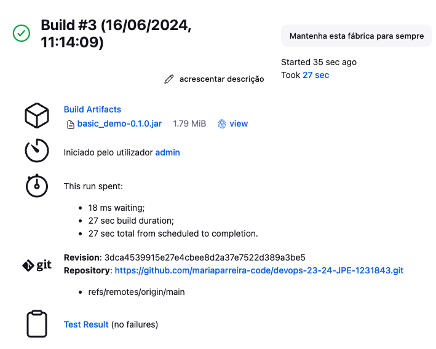

# Technical Report for Class Assignment 5


## Part 1: Gradle Basic Demo Project

### Step 1: Set up Jenkins

**Install Jenkins using Docker**

- Open your terminal/console and run the following command:

```bash
docker run -d -p 8080:8080 -p 50000:50000 -v jenkins-data:/var/jenkins_home --name=jenkins jenkins/jenkins:lts-jdk11
```

- Wait for Jenkins to start. You can access it by navigating to http://localhost:8080 in your web browser.

### Step 2: Create a Pipeline for the Gradle Basic Demo Project

**Create a Jenkins Job**

- Open Jenkins and log in.
- Click on "New Item" to create a new job.
- Select "Pipeline" and give it a name, e.g., "Gradle Basic Demo".

**Configure the Pipeline**

- In the job configuration, go to the "Pipeline" section.
- Set "Definition" to "Pipeline script from SCM".
- Set "SCM" to "Git" and provide the repository URL.
- In the "Script Path" field, enter the path to your Jenkinsfile, e.g., ca2/part1/gradle-basic-demo/Jenkinsfile.
- 
**Create the Jenkinsfile**

- In your repository, create a file named Jenkinsfile inside the CA5 directory with the following content:

```groovy
pipeline {
    agent any

    stages {
        stage('Checkout') {
            steps {
                git branch: 'main', url:'https://github.com/mariaparreira-code/devops-23-24-JPE-1231843.git'
            }
        }

        stage('Assemble') {
            steps {
                dir('CA2.Part1') {
                    sh './gradlew assemble'
                }
            }
        }

        stage('Test') {
            steps {
                dir('CA2.Part1') {
                    sh './gradlew test'
                }
            }
            post {
                always {
                    junit '**/build/test-results/**/*.xml'
                }
            }
        }

        stage('Archive') {
            steps {
                archiveArtifacts artifacts: '**/build/libs/*.jar', fingerprint: true
            }
        }
    }
}
```

### Step3: Verify the Pipeline Functionality in Jenkins

**Ensure the Jenkinsfile is in the Correct Path:**
- Make sure the Jenkinsfile is located in the correct path within the repository
- Verify that the content of the Jenkinsfile is correct as per the provided example.

**Run the Job in Jenkins:**
- Save the Configuration and Start the Pipeline.
- Save the configuration and click on "Build Now" to start the pipeline.
- Monitor the pipeline execution in the Jenkins interface. You will see logs for each stage (Checkout, Assemble, Test, Archive).

**Verify the Results:**
- After the execution, check the unit test results in the "Test Result" tab.

**Check Archived Artifacts:**
- Verify that the artifacts have been archived correctly in the "Artifacts" tab.


**My RESULTS**




----------------------------------------------------------------------

Part 2: Spring Boot Application
Step 1: Create a Pipeline for the Spring Boot Application
Create a Jenkins Job:

Open Jenkins and log in.
Click on "New Item" to create a new job.
Select "Pipeline" and give it a name, e.g., "Spring Boot Application".
Configure the Pipeline:

In the job configuration, go to the "Pipeline" section.
Set "Definition" to "Pipeline script from SCM".
Set "SCM" to "Git" and provide the repository URL.
In the "Script Path" field, enter the path to your Jenkinsfile, e.g., ca2/part2/spring-boot-app/Jenkinsfile.
Step 2: Create the Jenkinsfile
In your repository, create a file named Jenkinsfile inside the ca2/part2/spring-boot-app/ directory with the following content:

```groovy
pipeline {
    agent any

    stages {
        stage('Checkout') {
            steps {
                git branch: 'main', url:'https://github.com/mariaparreira-code/devops-23-24-JPE-1231843.git'
            }
        }

        stage('Assemble') {
            steps {
                dir('CA2.Part2/demoWithGradle') {
                    bat './gradlew assemble'
                }
            }
        }

        stage('Test') {
            steps {
                dir('CA2.Part2/demoWithGradle') {
                    bat './gradlew test'
                }
            }
            post {
                always {
                    junit '**/build/test-results/**/*.xml'
                }
            }
        }

        stage('Javadoc') {
            steps {
                dir('CA2.Part2/demoWithGradle') {
                    bat './gradlew javadoc'
                }
            }
            post {
                always {
                    publishHTML(target: [
                            allowMissing         : false,
                            alwaysLinkToLastBuild: false,
                            keepAll              : true,
                            reportDir            : 'CA2.Part2/demoWithGradle/build/docs/javadoc',
                            reportFiles          : 'index.html',
                            reportName           : 'Javadoc'
                    ])
                }
            }
        }

        stage('Archive') {
            steps {
                archiveArtifacts artifacts: '**/build/libs/*.war', fingerprint: true
            }
        }

        stage('Publish Image') {
            steps {
                script {
                    dir('CA5/Part2') {
                        bat 'copy ..\\..\\CA2.Part2\\demoWithGradle\\build\\libs\\*.war .'
                        def app = docker.build("mariaparreira-code/devops_23_24:${env.BUILD_NUMBER}")
                        docker.withRegistry('https://registry.hub.docker.com', 'dockerhub_credentials') {
                            app.push()
                        }
                    }
                }
            }
        }
    }
}
```
Step 3: Add Unit Tests
Make sure you have unit tests in your project. If not, add some basic unit tests. Here is an example of a simple JUnit test:

java
Copiar código
import org.junit.jupiter.api.Test;
import static org.junit.jupiter.api.Assertions.assertEquals;

public class SimpleTest {

    @Test
    public void testSum() {
        int sum = 1 + 1;
        assertEquals(2, sum);
    }
}
Final Steps
Push your changes to the repository:

Ensure that your Jenkinsfile and unit tests are committed and pushed to your repository.
Tag your repository:

After completing the assignment, tag your repository with ca5:
bash
Copiar código
git tag ca5
git push origin ca5
Run the Jenkins Jobs:

Go to Jenkins and run the jobs to see if everything is set up correctly and the pipeline runs smoothly.
By following these steps, you should be able to set up your Jenkins pipelines for both the Gradle basic demo project and the Spring Boot application. Let me know if you need any further assistance!


